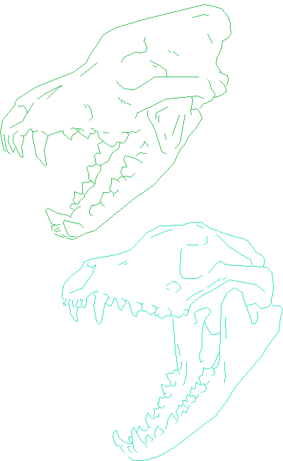
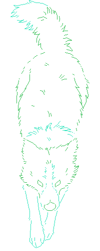

## About Me

    

        

            

                Computational biologist and principal scientist focused on evolution and development, genotype-to-phenotype relationships, and functional consequences of DNA sequence variation across animal species.
            

            

                I am currently leading multiple species de‑extinction projects at Colossal Biosciences (<a href="https://colossal.com/">colossal.com</a>), a company that sits at the intersection of synthetic biology and biodiversity conservation. We leverage genome engineering technology and multi‑omics datasets spanning extant and extinct species, as well as modern and historic populations, to preserve and restore biodiversity.
            

            

            As a PhD candidate at the University of Massachusetts Chan Medical School in the Karlsson Laboratory, I explored elements of the genome that shape variation in canine behavior. We partner with people and their dogs through the Darwin's Ark project (<a href="https://darwinsark.org/">darwinsark.org</a>) and the Dog Aging Project (<a href="https://dogagingproject.org">dogagingproject.org</a>). 
            

    
            

            My past research spanned diverse topics, from resilience and genetic diversity in marine sea grasses to the effects of retrotransposon activation on neurodegeneration in the brain to genetic switches encoded for defending bacteria against DNA damage which can be hijacked by bacteriophage viruses.
            

        

        
    

    

        
        

            

                I have cultivated a diverse skillset spanning many functional domains and datasets, including gene regulation (bulk and single-cell RNA-seq); chromatin contacts (HiC, LinkPrep), states (histone ChIP-seq), and accessibility (ATAC-seq); germline and somatic genome variant calling from short‑ and long‑read whole‑genome sequencing. I approach leadership with the same thoroughness, attentiveness, and commitment that defines my research.
            

            

                Beyond scientific research, I am also an illustrator exploring the intersection of art and science, and novice game developer in my free time building fun and interactive tools with a special interest in virtual and artificial life simulations.
            

            
Thank you for checking out my profile, and feel free to reach out via email or on any platform linked!

            
Kathleen Morrill Pirovich

        

    

